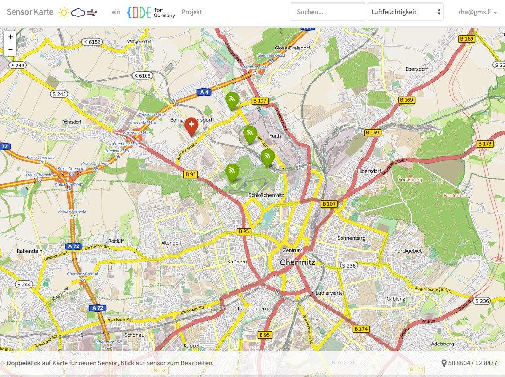

# Sensorkarte

ein  Projekt

Im Rahmen der Citizen-Science hat sich das OK Lab Chemnitz zum Ziel gesetzt
eine Plattform zu entwickeln, die zum einen die Erfassung und Verwaltung von Messstation und deren einzelner Sensoren ermöglichen soll.
Zum anderen sollen die Daten von den Sensoren in einer geeigneten hochperformanten Datenplattform abgelegt werden.

Alle Ideen und Gedanken finden sich im [Citizen-Science-Wiki](https://github.com/codeforgermany/citizen-science/wiki/Messdaten-Speicherung)

## Ziel dieser App
Dieses App hier kümmert sich um die Erfassung und Verwaltung der Stationen und deren Sensoren.

** http://codeforchemnitz-sensors.meteor.com **

## Technische Basis
Meteor: Node.JS, Bootstrap, MongoDB, [Leaflet](https://github.com/bevanhunt/meteor-leaflet)

### Warum Meteor?
Dinge auf einer Karte eintragen und bearbeiten ist der klassische Fall einer Web-**App**. Durch Meteor als Full-Stack-Framework bleibt praktisch nur noch die Business-Logik übrig. Durch unglaublich viele und gute Pakete können ganze Komponenten wie das Accounting praktisch per Einzeiler integriert werden.

> Meteor is a platform built on top of Node.js for building real-time web apps. It's what sits between your app's database and its user interface and makes sure that both are kept in sync.
https://book.discovermeteor.com/chapter/introduction

Spannend für dieses Projekt: Via SimpleSchema, Minimongo und AutoForm hat man ein selbstabgleichendes und selbstvalidierendes Datenmodell in einer Dokumenten basierenden Datenbank

[zur Paketliste](.meteor/packages)

## Mitwirken
Die Meteor-Plattform macht das mitwirken sehr einfach:

1. `git clone https://github.com/codeforchemnitz/sensor-karte`
2. `cd sensor-karte`
3. `meteor run`
4. Browser öffnen: [localhost:3000](http://localhost:3000)

## TODOs

**Offen:**
- eigene Sensortypen für Bodentemperatur, Wassertemperatur, Lufttemperatur
- Station und Sensoren mit einfachen Keys identifizieren
  - (stations.key: {unique:true}, stations.sensors.key: {unique:true})
  - recordShow: Liste Sensor-Key ist zusammengesetzt?
- Sensordaten in neue Collection + visualisieren
- Accounts: Name + Vorname als Pflichtfeld -> Verwendung zum Vorausfüllen bei Stations-Anlage
- Filtern/Suchen:
  - nach Suchbegriff,
  - nach Sensortyp,
  - per Umkreissuche (neben bestehenden Filtern) -> 100m, 1km, 10km, 100km

**Erledigt:**

- Station hinzufügen, ändern, löschen
- Account-Management (erstmal nur Email + Pwd)
- Leaflet-Karte als zentrales Element

## Meteor Debugging

### Kadira
Im Meteor-Umfeld existiert mit [Kadira](https://kadira.io/) ein Remote-Echtzeit-Performance-und-Debugging-Service.

**Einrichtung:**
- Anmelden bei [kadira.io](https://kadira.io/)
- `server/kadira.js.dist` umbenennen nach server/kadira.js` und Credentials eintragen
- Meteor starten
- [Kadira Webfrontend](https://ui.kadira.io/) öffnen

### DDP Verkehr monitoren
Im Meteor-Framework werden alle Daten zwischen Client und Server via [*Distributed Data Protocol*](https://www.meteor.com/ddp) (DDP) ausgetauscht.

Mit dem `ddp-analyzer` als Proxy kann der Traffic mitverfolgt werden. Das ist ungemein praktisch um herauszufinden wo welche Daten abgeglichen oder gelesen werden.

Hier gehts zur [Anleitung zum Installieren/Einrichten](https://meteorhacks.com/discover-meteor-ddp-in-realtime).

**TL;DR**
- ggf. Meteor stoppen
- *.. in zweiten Terminal ..*
- `sudo npm install -g ddp-analyzer`
- `ddp-analyzer-proxy` (anderer Tab)
- *.. wieder im ersten Terminal ..*
- `export DDP_DEFAULT_CONNECTION_URL=http://localhost:3030`
- Meteor starten mit `meteor`

## Kompatiblität
Getested mit Webkit, Firefox, IE9, iPhone, und iPad

## Deployment
Derzeit erfolgt das Deployment noch auf die Meteor-Plattform und ist unter http://codeforchemnitz-sensors.meteor.com erreichbar.

Die Aktualisierung erfolgt durch:

`meteor deploy codeforchemnitz-sensors`

Für den Produktivmodus soll die App auf dem Codefor-Server gehostet werden.

Alternativ findet sich ein PaaS-Spender für die App (Galaxy ist ja gerade noch in der Entwicklung und auf der [Meteor Roadmap](https://trello.com/b/hjBDflxp/meteor-roadmap))

Anleitung für den "harten" Weg es selber zu hosten: https://scotch.io/tutorials/building-a-slack-clone-in-meteor-js-part-5-deployment

## Lizenz
MIT
